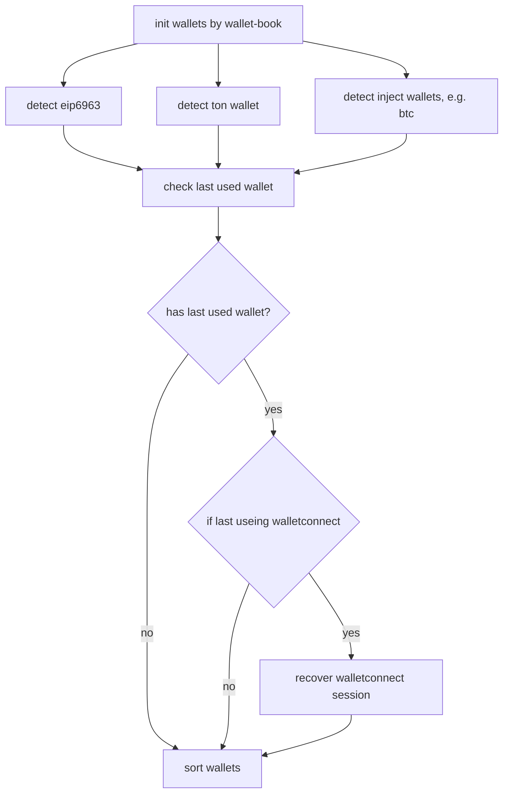

# Codatta Connect

Codatta Connect Kit is a set of tools that helps quickly integrate Codatta-based login and wallet linking features into applications.

<!-- wallet init process -->

```mermaid
graph TD;
  A[init wallets by wallet-book] --> B[detect eip6963]
  A --> C[detect ton wallet]
  A --> D[detect inject wallets, e.g. btc]
  B --> E[check last used wallet]
  C --> E
  D --> E
  E --> F{has last used wallet?}
  F --> |yes| I{if last useing walletconnect}
  F --> |no| H[sort wallets]
  I --> |yes| J[recover walletconnect session]
  I --> |no| H[sort wallets]
  J --> H
```